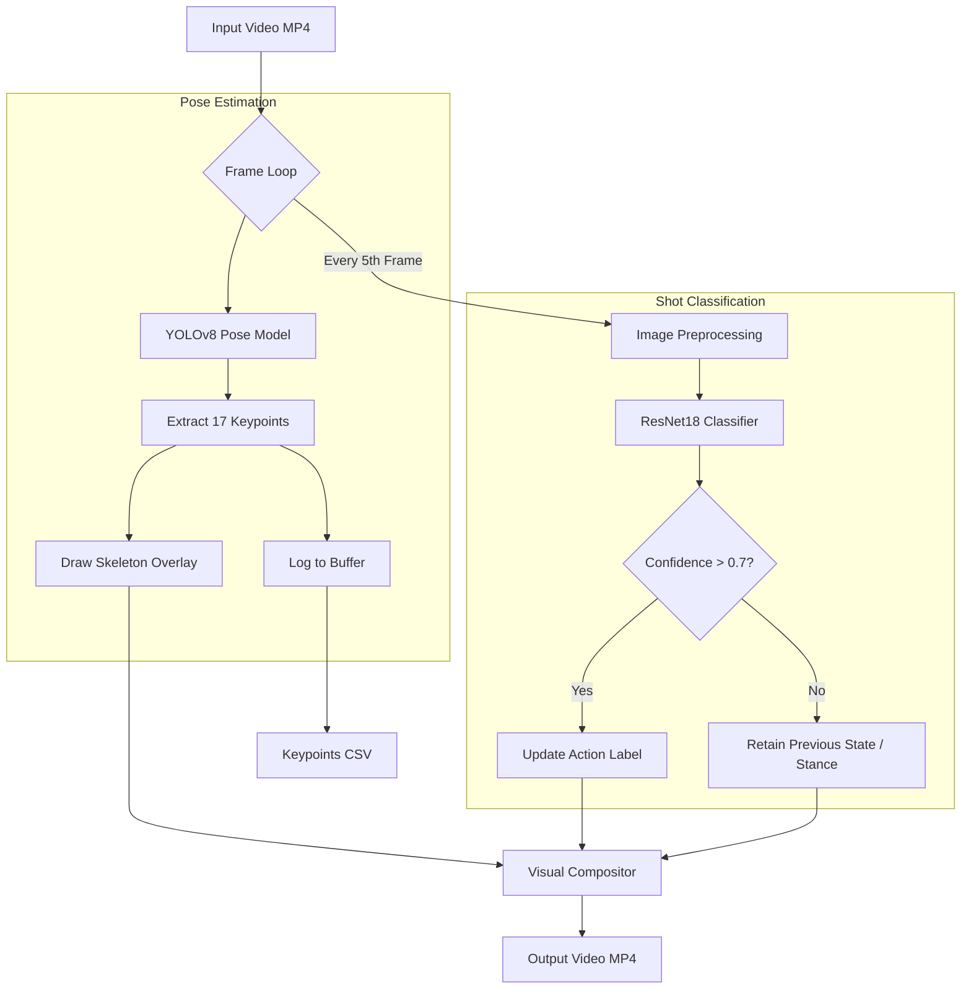

# Cricket Biomechanics & Shot Classification Pipeline


## Project Overview

This project implements a computer vision pipeline designed for cricket biomechanics analysis. It processes side-on video footage of a cricket player to perform two simultaneous tasks:
1.  **Pose Estimation:** Tracking 17 skeletal keypoints using YOLOv8-Pose to analyze body movement.
2.  **Action Recognition:** Classifying the specific cricket shot (Drive, Pull, Sweep, Flick) using a fine-tuned ResNet18 neural network.

The output serves as a foundation for performance analytics, generating both a visual overlay video and a quantitative CSV dataset of joint coordinates.

## System Architecture

The pipeline processes video frames to extract spatial data (pose) and semantic data (shot type). To optimize performance, pose estimation runs on every frame, while the heavier classification model runs on specific intervals with a confidence gate.



## Repository Structure

```text
├── data/                       # Training dataset for the classifier
├── model/
│   ├── cricket_shot_classifier.pth  # Fine-tuned ResNet18 weights
│   └── yolo26n-pose.pt              # Pre-trained YOLO pose weights
├── video/
│   ├── input/                  # Raw footage
│   └── output/                 # Processed video with overlays
├── main.py                     # Primary pipeline (Pose + Classification)
├── player_tracking.py          # Standalone pose tracking script
├── shot_classifier.ipynb       # Model training notebook
├── keypoints.csv               # Generated data output
├── uv.lock                     # Dependency lock file
└── README.md                   # Documentation
```

## Methodology & Design Decisions

### 1. Pose Estimation (YOLOv8)
I selected YOLOv8-pose over alternatives like OpenPose or MediaPipe for the following reasons:
*   **Top-down vs Bottom-up:** YOLO is effectively a top-down approach (detect person -> detect keypoints), which is robust when only one main subject is in focus, as is common in cricket analysis videos.
*   **Inference Speed:** The Nano/Small versions of YOLO run at high FPS on consumer hardware, allowing for rapid iteration.

### 2. Shot Classification (ResNet18)
Instead of a temporal model (LSTM/Transformer), a CNN (ResNet18) was chosen for this specific iteration:
*   **Distinct Spatial Features:** Cricket shots (e.g., the high elbow of a drive vs. the cross-bat of a pull) have distinct static visual signatures that CNNs identify well.
*   **Data Efficiency:** Using Transfer Learning on ResNet18 allowed the model to reach high accuracy with a small dataset of cricket images.
*   **Logic Integration:** To prevent flickering predictions, a confidence threshold (>0.70) and frame-skipping (every 5 frames) logic were implemented.

## Performance Metrics & Analysis

The pipeline generates `keypoints.csv` containing frame-by-frame (x, y) coordinates for 17 body parts. This data allows for the calculation of specific biomechanical metrics:

1.  **Front Knee Flexion:**
    *   *Calculation:* Angle between Hip-Knee-Ankle vectors.
    *   *Relevance:* Determines stability during a cover drive.
2.  **Backlift Height:**
    *   *Calculation:* Vertical distance of the wrists relative to the hip.
    *   *Relevance:* Higher backlift correlates with power generation in aggressive shots.
3.  **Head Stability:**
    *   *Calculation:* Variance of the Nose (x, y) coordinates over the duration of the shot.
    *   *Relevance:* A stable head is a primary indicator of professional batting technique.

## Observations & Limitations

*   **Jitter:** The raw keypoints exhibit slight high-frequency noise. In a production environment, a Holt-Winters exponential smoothing filter or a Kalman filter should be applied to the CSV data.
*   **Occlusion:** In a side-on view, the bowler's arm or the bat occasionally obstructs the torso. The model generally infers the position, but accuracy drops during these frames.
*   **Shot Transition:** The classifier operates on static frames. It occasionally misclassifies the "follow-through" of a drive as a generic stance. A temporal model (LSTM) would solve this by understanding the sequence of motion.

## Setup and Usage

### Prerequisites
Ensure Python 3.10+ is installed.

```bash
# Install dependencies
pip install opencv-python pandas torch torchvision ultralytics numpy
```

### Running the Pipeline
To run the full analysis (Tracking + Classification):

```bash
python main.py
```
The output video will be saved to `video/output/output_overlay.mp4` and the data to `keypoints.csv`.

### Training the Classifier
If you wish to retrain the shot detection model:
1.  Place images in `data/` folders named by class (e.g., `data/drive`, `data/sweep`).
2.  Run the notebook `shot_classifier.ipynb`.
